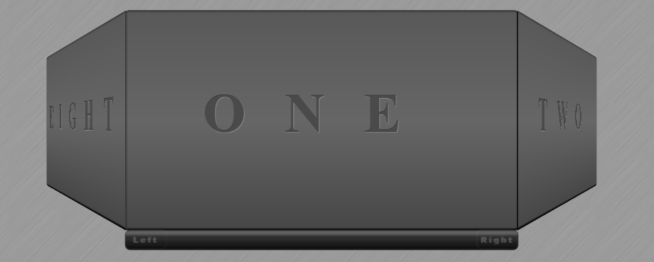

# jumbotron_prototype

This is a little study of 3D CSS animation. This became the prototype for the Jumbotron post spinner at the top of the front page of this website. This is an early version frame with som basic controls just to be able to view all of the sides.

Checkout the Codepen:https://codepen.io/DarkMG73/pen/YreZmm

My site: http://www.glassinteractive.com

